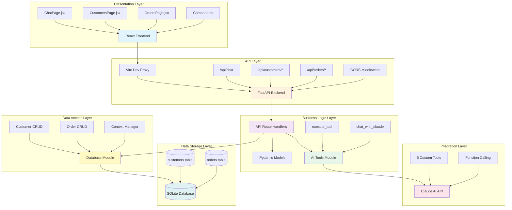
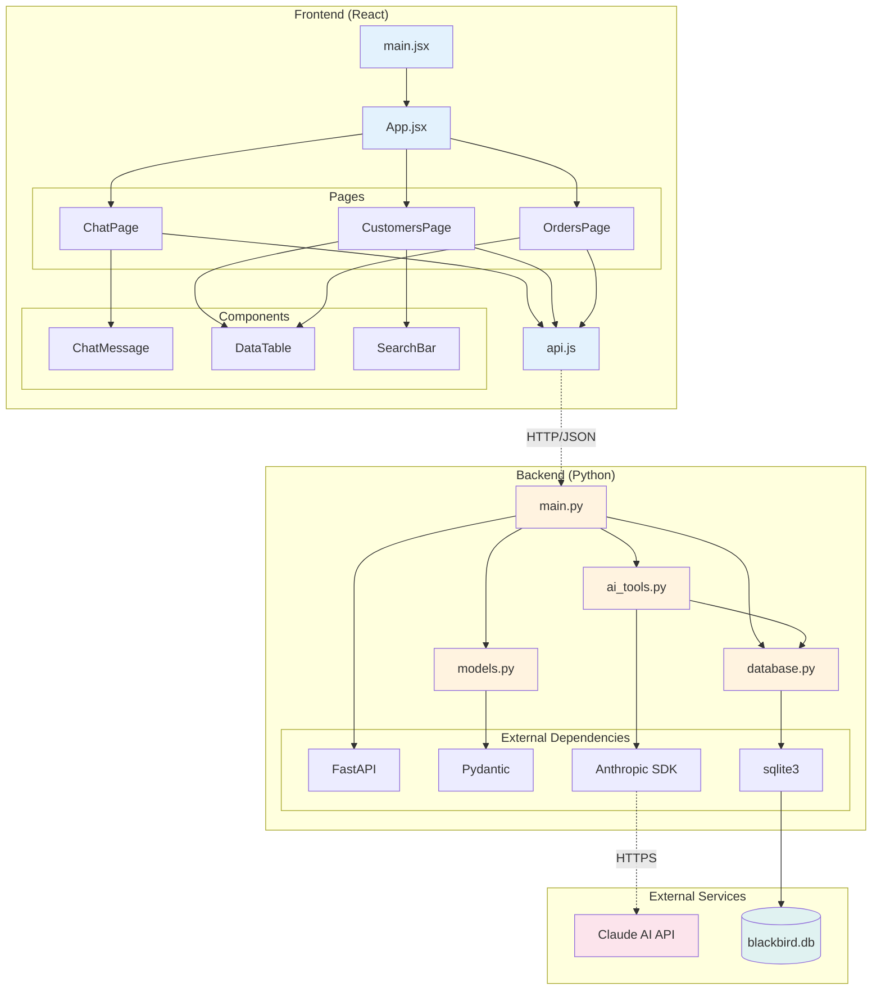
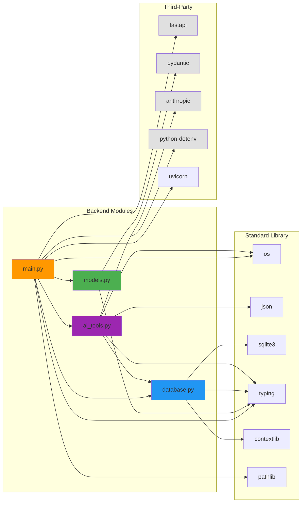
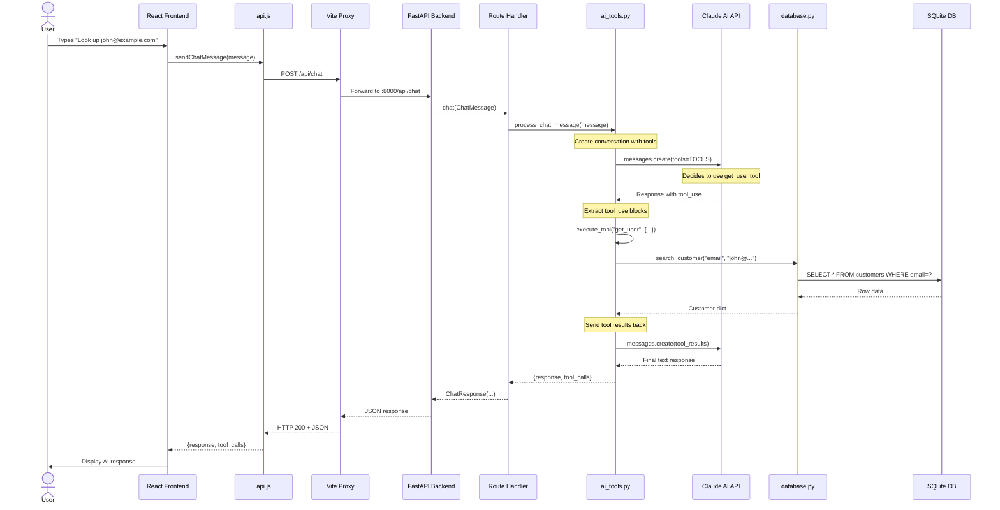
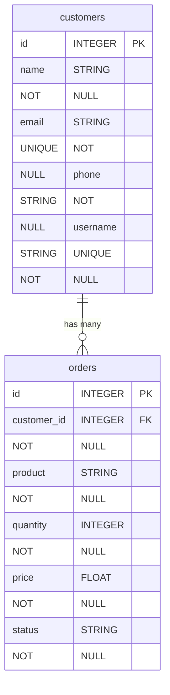
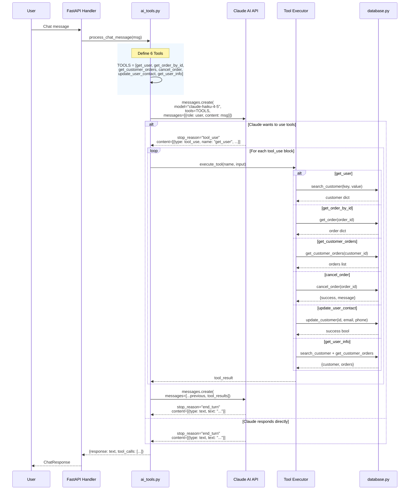

# Architecture Diagrams

## Overview

This document provides comprehensive architectural diagrams for the Blackbird Customer Support Application, a full-stack web application demonstrating Claude AI integration with FastAPI and React. The system consists of:

- **Frontend**: React SPA with three main pages (AI Chat, Customers, Orders)
- **Backend**: FastAPI REST API with AI tool calling integration
- **Database**: SQLite database for customer and order management
- **AI Integration**: Claude AI (Anthropic) with 6 custom tools for customer support operations

---

## 1. System Architecture (Layered View)

This diagram shows the high-level architecture organized into distinct layers, illustrating the separation of concerns and data flow through the system.



### Key Points

- **Presentation Layer**: React-based SPA with client-side routing (React Router). Three main pages for different user workflows.
- **API Layer**: FastAPI serves RESTful endpoints with CORS enabled. Vite proxy handles development routing.
- **Business Logic Layer**: Route handlers orchestrate data validation (Pydantic), database operations, and AI integration.
- **Integration Layer**: Claude AI provides intelligent assistance through 6 custom tools (get_user, get_order_by_id, get_customer_orders, cancel_order, update_user_contact, get_user_info).
- **Data Access Layer**: Abstracted database operations with context managers for connection handling.
- **Data Storage Layer**: SQLite database with foreign key constraints and indexed columns for performance.

---

## 2. Component Relationships

This diagram illustrates how the main modules and components interact with each other, showing the dependencies and communication patterns.



### Key Points

- **Frontend Entry Point**: `main.jsx` initializes React and renders `App.jsx`
- **Routing**: `App.jsx` manages client-side routing to three pages
- **API Abstraction**: `api.js` provides a clean interface for all backend communication
- **Page Components**: Each page imports shared components (ChatMessage, DataTable, SearchBar)
- **Backend Entry Point**: `main.py` defines FastAPI app and all route handlers
- **Data Validation**: `models.py` (Pydantic) ensures type safety for all API requests/responses
- **Data Persistence**: `database.py` handles all SQLite operations with context managers
- **AI Integration**: `ai_tools.py` manages Claude AI communication and tool execution
- **External Dependencies**: Clear separation of framework code (FastAPI, Pydantic, Anthropic SDK)

---

## 3. Class Hierarchies

This diagram shows the Pydantic model structure and their relationships, which define the data contracts throughout the application.

```mermaid
classDiagram
    class BaseModel {
        <<Pydantic>>
        +model_validate()
        +model_dump()
        +Config
    }

    class Customer {
        +str id
        +str name
        +EmailStr email
        +str phone
        +str username
        +pattern: r'^\\d{7}$' (id)
        +pattern: r'^\\d{3}-\\d{3}-\\d{4}$' (phone)
        +pattern: r'^[a-zA-Z0-9_]+$' (username)
    }

    class CustomerUpdate {
        +Optional~EmailStr~ email
        +Optional~str~ phone
        +pattern: r'^\\d{3}-\\d{3}-\\d{4}$' (phone)
    }

    class CustomerSearch {
        +Literal['email'|'phone'|'username'] key
        +str value
    }

    class Order {
        +str id
        +str customer_id
        +str product
        +int quantity
        +float price
        +Literal['Processing'|'Shipped'|'Delivered'|'Cancelled'] status
        +pattern: r'^\\d{5}$' (id)
        +pattern: r'^\\d{7}$' (customer_id)
        +constraint: quantity > 0
        +constraint: price >= 0
    }

    class OrderCancelResponse {
        +bool success
        +str message
    }

    class ChatMessage {
        +str message
        +min_length: 1
        +max_length: 4000
    }

    class ChatResponse {
        +str response
        +Optional~List~Dict~str,Any~~~ tool_calls
    }

    class CustomerWithOrders {
        +Customer customer
        +List~Order~ orders
    }

    class ErrorResponse {
        +str error
        +Optional~str~ detail
    }

    BaseModel <|-- Customer
    BaseModel <|-- CustomerUpdate
    BaseModel <|-- CustomerSearch
    BaseModel <|-- Order
    BaseModel <|-- OrderCancelResponse
    BaseModel <|-- ChatMessage
    BaseModel <|-- ChatResponse
    BaseModel <|-- CustomerWithOrders
    BaseModel <|-- ErrorResponse

    CustomerWithOrders *-- Customer
    CustomerWithOrders *-- Order

    note for Customer "7-digit ID\nEmail validation\nPhone format XXX-XXX-XXXX"
    note for Order "5-digit ID\nForeign key to Customer\nStatus enum constraint"
    note for CustomerWithOrders "Composite model\nCombines Customer + Orders"
```

### Key Points

- **Inheritance**: All models inherit from Pydantic's `BaseModel` for automatic validation
- **Field Validation**: Pattern matching ensures data integrity (customer ID: 7 digits, order ID: 5 digits, phone format)
- **Type Safety**: EmailStr provides email validation, Literal types enforce enums
- **Constraints**: Quantity must be positive, price must be non-negative
- **Composition**: `CustomerWithOrders` combines customer and order data for efficient queries
- **API Contracts**: These models define the shape of all API requests and responses
- **Optional Fields**: `CustomerUpdate` allows partial updates, `ChatResponse.tool_calls` is optional for transparency

---

## 4. Module Dependencies

This diagram shows the import relationships between Python modules, revealing the dependency structure and potential circular dependencies.



### Key Points

- **Entry Point**: `main.py` is the root module that imports all other application modules
- **Clean Separation**: No circular dependencies between modules
- **Database Independence**: `database.py` only depends on standard library (sqlite3, contextlib, typing)
- **Model Isolation**: `models.py` only depends on Pydantic, no application logic
- **AI Integration**: `ai_tools.py` depends on `database.py` but not `models.py` or `main.py`
- **Dependency Flow**: main.py → {models.py, database.py, ai_tools.py}, ai_tools.py → database.py
- **Framework Usage**: FastAPI and Pydantic in presentation layer, Anthropic SDK in AI layer, SQLite in data layer

---

## 5. API Request Flow

This sequence diagram illustrates how a typical chat request flows through the system, demonstrating the multi-turn conversation pattern with Claude AI tool calling.



### Key Points

- **Vite Proxy**: Development proxy routes `/api/*` to backend `localhost:8000/api/*`
- **Request Validation**: FastAPI automatically validates request body against `ChatMessage` Pydantic model
- **Multi-Turn Conversation**: Claude AI may call tools multiple times before final response
- **Tool Execution Loop**: While `stop_reason == "tool_use"`, execute tools and send results back
- **Tool Transparency**: Response includes `tool_calls` array for debugging/transparency
- **Database Access**: Each tool execution may query the database through the abstracted `database.py` module
- **Error Handling**: Try-catch at multiple levels (API layer, tool execution, database access)
- **Response Serialization**: Pydantic models ensure type-safe JSON serialization

---

## 6. Database Schema

This ER diagram shows the database structure, relationships, and constraints.



### Database Details

**Indexes:**
```sql
-- Performance indexes
CREATE INDEX idx_customers_email ON customers(email);
CREATE INDEX idx_customers_username ON customers(username);
CREATE INDEX idx_orders_customer_id ON orders(customer_id);
CREATE INDEX idx_orders_status ON orders(status);
```

**Constraints:**
- **Foreign Key**: `orders.customer_id` references `customers.id` with `ON DELETE CASCADE`
- **CHECK Constraints**:
  - `customers.name` length >= 1
  - `customers.email` LIKE '%@%.%'
  - `customers.phone` length >= 10
  - `customers.username` length 3-20
  - `orders.quantity` > 0
  - `orders.price` >= 0
  - `orders.status` IN ('Processing', 'Shipped', 'Delivered', 'Cancelled')
  - `orders.product` length >= 1

**Relationship:**
- One customer can have many orders (1:N)
- Cascade delete: When customer is deleted, all their orders are deleted

### Key Points

- **Primary Keys**: Text-based IDs (customer: 7 digits, order: 5 digits)
- **Unique Constraints**: Email and username must be unique across customers
- **Referential Integrity**: Foreign key constraint with cascade delete
- **Data Validation**: CHECK constraints enforce business rules at database level
- **Query Performance**: Indexes on frequently searched columns (email, username, customer_id, status)
- **Status Enum**: Orders have exactly 4 possible statuses
- **Row Factory**: `sqlite3.Row` used in context manager for dictionary-like access

---

## 7. AI Integration Flow

This diagram shows how the Claude AI integration works with tool calling, including the tool definitions and execution flow.



### AI Tools Reference

**Tool Definitions (ai_tools.py lines 26-129):**

1. **get_user**: Search customer by email, phone, or username
   - Input: `{key: enum, value: string}`
   - Returns: Customer information if found

2. **get_order_by_id**: Lookup order by 5-digit order ID
   - Input: `{order_id: string}`
   - Returns: Order details (product, quantity, price, status)

3. **get_customer_orders**: Get all orders for a customer
   - Input: `{customer_id: string}`
   - Returns: List of orders

4. **cancel_order**: Cancel an order (only if status = 'Processing')
   - Input: `{order_id: string}`
   - Returns: `{success: bool, message: string}`

5. **update_user_contact**: Update customer email/phone
   - Input: `{customer_id: string, email?: string, phone?: string}`
   - Returns: `{success: bool, message: string}`

6. **get_user_info**: Combined customer + orders query
   - Input: `{key: enum, value: string}`
   - Returns: `{customer: {...}, orders: [...], order_count: int}`

### Key Points

- **Model**: Uses `claude-haiku-4-5-20251001` (latest Claude 3.5 Haiku model)
- **Tool Schema**: JSON Schema format defining input parameters and descriptions
- **Multi-Turn Loop**: Continues sending tool results back until Claude finishes (`stop_reason != "tool_use"`)
- **Error Handling**: Try-catch around tool execution returns error in tool result
- **Tool Transparency**: All tool calls logged and returned to frontend for debugging
- **Stateless**: Current implementation doesn't maintain conversation history (educational simplification)
- **Function Dispatch**: `execute_tool()` routes to appropriate database function based on tool name
- **Business Logic**: Tools enforce business rules (e.g., can only cancel Processing orders)

---

## Additional Architecture Notes

### File Structure
```
{PROJECT_ROOT}/
├── backend/
│   ├── main.py           # FastAPI app, routes, startup
│   ├── models.py         # Pydantic models
│   ├── database.py       # SQLite CRUD operations
│   ├── ai_tools.py       # Claude AI integration
│   └── blackbird.db      # SQLite database file
├── frontend/
│   ├── src/
│   │   ├── main.jsx      # React entry point
│   │   ├── App.jsx       # Routing and navigation
│   │   ├── api.js        # Backend API wrapper
│   │   ├── pages/        # ChatPage, CustomersPage, OrdersPage
│   │   └── components/   # Reusable UI components
│   └── index.html        # HTML template
└── pyproject.toml        # Python dependencies
```

### Technology Stack

**Frontend:**
- React 18 with JSX
- React Router for client-side routing
- Vite for development server and build
- Fetch API for HTTP requests

**Backend:**
- FastAPI for REST API
- Pydantic for data validation
- SQLite3 for database
- Anthropic SDK for Claude AI
- Uvicorn for ASGI server

**Development:**
- CORS enabled for local development
- Vite proxy for API routing
- Environment variables via python-dotenv

### Security Considerations

1. **API Key**: ANTHROPIC_API_KEY stored in `.env` file (not committed)
2. **SQL Injection**: Parameterized queries used throughout
3. **Input Validation**: Pydantic models validate all inputs
4. **CORS**: Restricted to specific origins (localhost:5173, localhost:3000)
5. **Foreign Keys**: Enabled in SQLite for referential integrity

### Scalability Notes

**Current Limitations (Educational Demo):**
- SQLite database (single-file, not for high concurrency)
- No authentication/authorization
- Stateless chat (no conversation history)
- No caching layer
- Synchronous database operations

**Production Improvements:**
- Use PostgreSQL/MySQL for production database
- Add JWT authentication
- Implement conversation history storage
- Add Redis cache for frequently accessed data
- Use async database library (asyncpg, aiomysql)
- Add rate limiting and request throttling
- Implement proper logging and monitoring

---

## Conclusion

The Blackbird Customer Support Application demonstrates a well-structured full-stack architecture with clear separation of concerns:

1. **Frontend** handles presentation and user interaction
2. **Backend** provides RESTful API with validation
3. **Database layer** abstracts data persistence
4. **AI layer** integrates Claude for intelligent assistance
5. **Models** ensure type safety across the stack

The architecture is designed for educational purposes, showcasing Claude AI function calling integration while maintaining clean code principles and proper separation of concerns.
