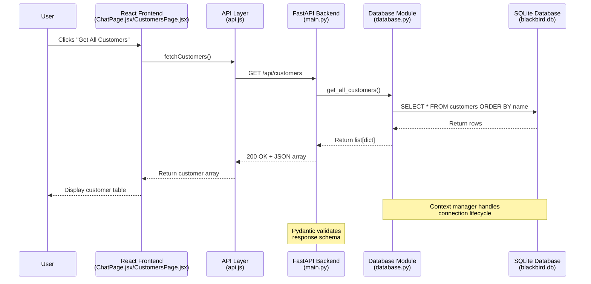
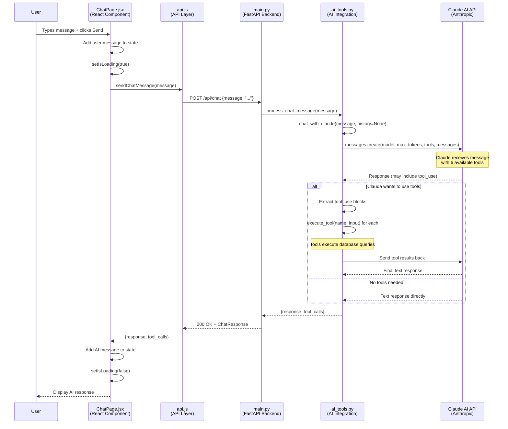
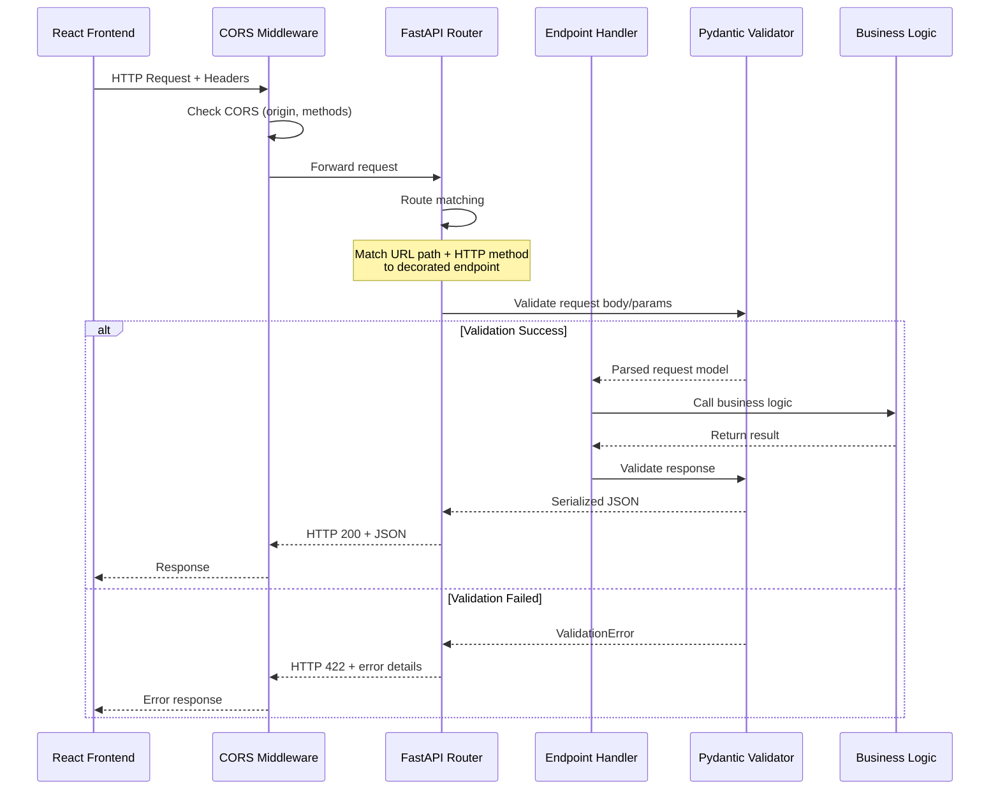
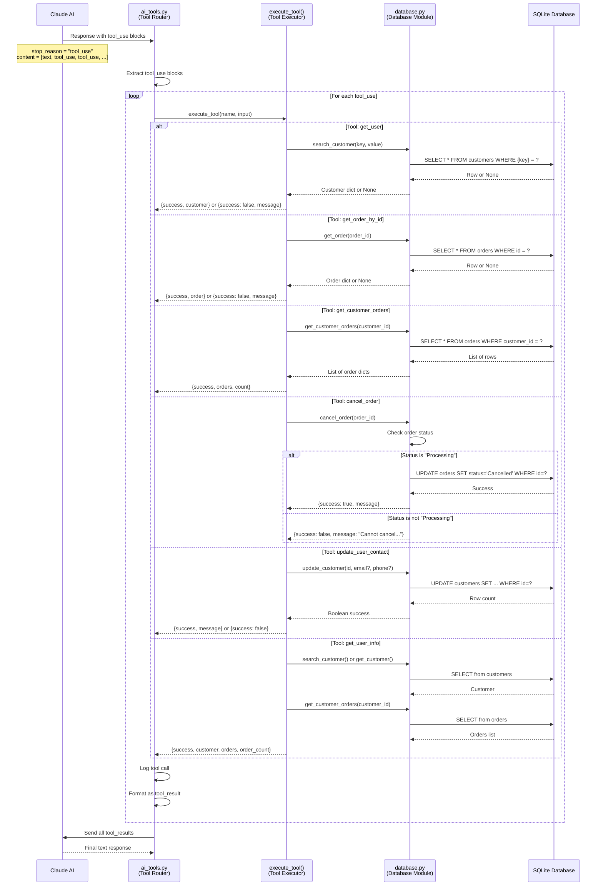
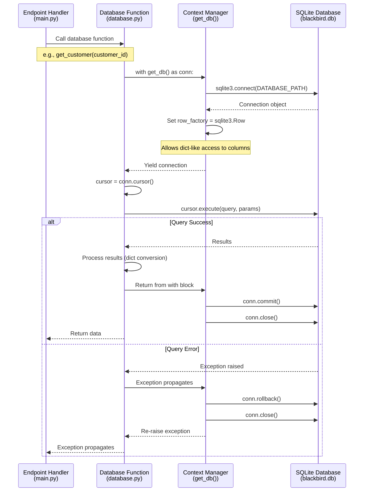
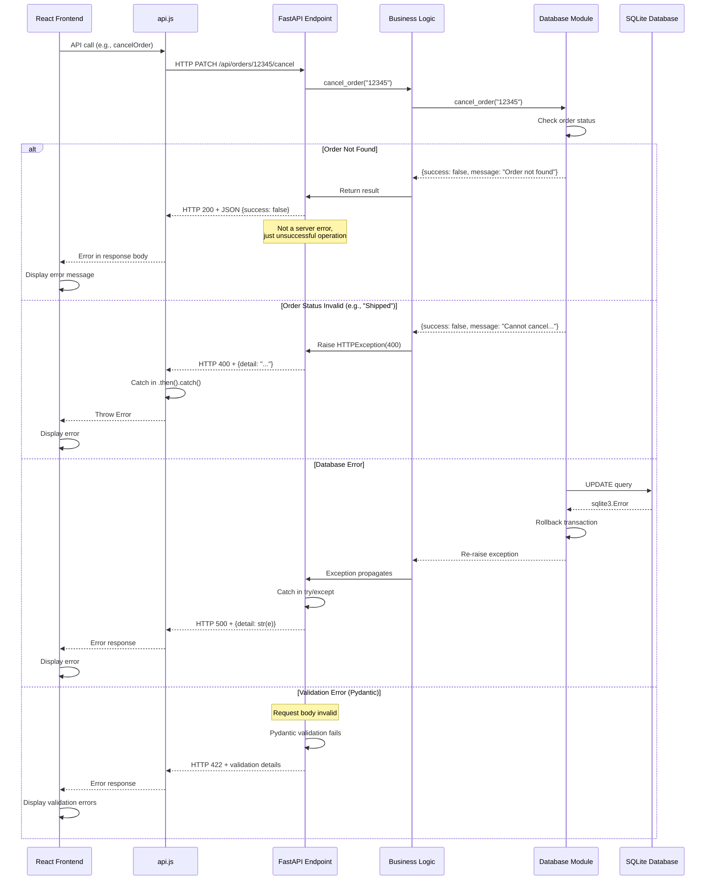

# Data Flow Analysis

## Overview

This document provides a comprehensive analysis of data flows in the Blackbird Customer Support Application. The application is a FastAPI backend with a React frontend that integrates Claude AI for intelligent customer support operations. The system demonstrates several key architectural patterns:

1. **RESTful API Communication** - Standard HTTP request/response between React frontend and FastAPI backend
2. **AI Tool Calling Flow** - Multi-turn conversation with Claude AI including tool execution
3. **Database Operations** - SQLite database interactions with context manager pattern
4. **Synchronous Processing** - Primarily synchronous operations with async API endpoints

The application does NOT use:
- MCP (Model Context Protocol) servers
- Websockets or streaming
- Complex permission callback flows
- Message queues or event buses

All data flows are straightforward HTTP-based interactions with Claude AI integration for intelligent tool calling.

---

## 1. Simple Query Flow (Direct API Requests)

This flow handles basic CRUD operations that don't require AI assistance - customers viewing data, searching records, or performing updates through the UI.



### Flow Steps

1. **User Action** (Browser)
   - User navigates to Customers page (`/customers`)
   - Component: `frontend/src/pages/CustomersPage.jsx`
   - Triggers data fetch on component mount via `useEffect`

2. **API Call** (Frontend → Backend)
   - Function: `fetchCustomers()` in `frontend/src/api.js` (lines 37-45)
   - Makes HTTP GET request to `/api/customers`
   - Uses Vite proxy to route to backend at `http://localhost:8000`

3. **Request Routing** (FastAPI)
   - Endpoint: `get_customers()` in `backend/main.py` (lines 101-108)
   - Route decorator: `@app.get("/api/customers", response_model=List[Customer])`
   - No authentication or authorization checks

4. **Database Query** (Database Module)
   - Function: `get_all_customers()` in `backend/database.py` (lines 151-162)
   - Uses context manager `get_db()` for connection handling (lines 71-98)
   - SQL: `SELECT * FROM customers ORDER BY name`
   - Row factory converts sqlite3.Row to dict

5. **Response Validation** (Pydantic)
   - FastAPI validates response against `List[Customer]` model
   - Customer model defined in `backend/models.py` (lines 15-42)
   - Validates: 7-digit ID, email format, phone pattern (XXX-XXX-XXXX), username pattern

6. **Response Rendering** (Frontend)
   - Browser receives JSON array of customers
   - React state updated with customer data
   - DataTable component renders the list

### Key Components

- **API Layer** (`api.js`): Provides fetch wrapper functions with error handling
- **FastAPI Endpoints** (`main.py`):
  - `/api/customers` - List all customers
  - `/api/customers/{customer_id}` - Get single customer
  - `/api/customers/search` - Search by email/phone/username
  - `/api/customers/{customer_id}` - PATCH update contact info
- **Database Module** (`database.py`): Provides CRUD operations with SQLite
- **Pydantic Models** (`models.py`): Request/response validation and serialization

### Error Handling

- **Database Errors**: Caught by context manager, triggers rollback, raises exception
- **Not Found (404)**: Returned when customer/order doesn't exist
  - Example: `main.py` line 116 - `raise HTTPException(status_code=404, detail=f"Customer {customer_id} not found")`
- **Validation Errors (400)**: Pydantic validates request body, returns 422 for invalid data
- **Server Errors (500)**: Generic exceptions caught and returned with error message
  - Example: `main.py` line 108 - `raise HTTPException(status_code=500, detail=str(e))`
- **Frontend Error Display**: Error messages shown in UI via error state

---

## 2. Interactive Client Session Flow (AI Chat)

This flow demonstrates stateless AI chat interactions. Each message is processed independently without maintaining conversation history on the backend (educational simplification).



### Flow Steps

1. **User Input** (`ChatPage.jsx` lines 35-77)
   - User types message in chat input field
   - Submits form via `handleSubmit()`
   - Message added to local state immediately for optimistic UI
   - Loading spinner shown

2. **API Request** (`api.js` lines 15-30)
   - `sendChatMessage(message)` called
   - POST request to `/api/chat` with JSON body `{message: "..."}`
   - Content-Type: application/json

3. **FastAPI Endpoint** (`main.py` lines 71-94)
   - Endpoint: `chat()` decorated with `@app.post("/api/chat", response_model=ChatResponse)`
   - Validates request body against `ChatMessage` model (1-4000 characters)
   - Calls `ai_tools.process_chat_message(message.message)`

4. **AI Processing Entry Point** (`ai_tools.py` lines 340-353)
   - `process_chat_message()` is a stateless wrapper
   - Calls `chat_with_claude(message, conversation_history=None)`
   - Educational note: Production would maintain per-user conversation history

5. **Claude API Integration** (`ai_tools.py` lines 224-334)
   - Initializes Anthropic client with API key from environment
   - Builds message array: `[{"role": "user", "content": message}]`
   - Calls Claude API with:
     - Model: `claude-haiku-4-5-20251001` (Claude 3.5 Haiku)
     - Max tokens: 1024
     - Tools: 6 tool definitions (lines 26-129)
     - Messages: Conversation history + new message

6. **Tool Use Loop** (`ai_tools.py` lines 276-316)
   - Check if `response.stop_reason == "tool_use"`
   - If yes:
     - Extract all `tool_use` blocks from response
     - For each tool: execute via `execute_tool()` (lines 136-217)
     - Collect results with tool_use_id
     - Send results back to Claude with updated message history
     - Repeat until Claude returns final text response
   - Track all tool calls in `tool_calls_log` for transparency

7. **Response Extraction** (`ai_tools.py` lines 318-327)
   - Extract text from response content blocks
   - Return `{response: text, tool_calls: log}`

8. **Frontend Update** (`ChatPage.jsx` lines 54-62)
   - Add assistant response to messages array
   - Include tool_calls for debugging display
   - Loading state cleared
   - Auto-scroll to bottom of chat

### Key Components

- **ChatPage Component**: Manages conversation state in React (stateful)
- **AI Tools Module**:
  - 6 tool definitions with JSON schemas
  - Tool execution logic calling database functions
  - Claude API integration with tool calling loop
- **Claude AI**: External LLM service with function calling capability
- **Database Functions**: Called by tools to retrieve/modify data

### State Management

**Frontend State** (React `useState` in ChatPage.jsx):
- `messages`: Array of message objects `{role, content, toolCalls}`
- `input`: Current input field value
- `isLoading`: Boolean for loading indicator
- `error`: Error message string or null

**Backend State**:
- **Stateless**: Each request is independent
- No session storage or user context
- Conversation history NOT persisted
- Educational trade-off for simplicity

**Why Stateless?**:
- Simplifies teaching AI integration concepts
- Avoids session management complexity
- Each request demonstrates complete tool calling cycle
- Production apps would use session storage or database

### Session Persistence (Not Implemented)

The current implementation is intentionally stateless for educational purposes. A production implementation would include:

1. **Session Storage**: Redis or database table for conversation history
2. **User Context**: Associate conversations with user IDs
3. **History Management**: Maintain message history per session
4. **Timeout**: Clear old conversations after inactivity
5. **Context Window**: Truncate history to fit Claude's context limit

---

## 3. Tool Permission Callback Flow

**This flow is NOT APPLICABLE to this codebase.**

### Explanation

The Blackbird Customer Support Application does not implement a tool permission callback system. All tool executions are automatic and unrestricted once a user sends a chat message to the AI.

**Why Not Implemented:**

1. **Educational Focus**: This is a teaching application demonstrating AI tool calling basics
2. **Trusted Environment**: Assumes the user is a customer support agent with appropriate access
3. **Simple Use Case**: Tools only perform read operations and limited writes (cancel order, update contact)
4. **No Sensitive Operations**: No destructive operations like delete, no financial transactions, no PII exposure

**What Would Be Required for Tool Permissions:**

In a production environment with sensitive operations, you might implement:

1. **Pre-approval Flow**:
   - AI proposes tool use
   - User prompted to approve/deny
   - Approval sent back to continue execution

2. **Role-Based Access Control (RBAC)**:
   - Tools tagged with required permissions
   - User authentication with role
   - Check permissions before tool execution

3. **Audit Trail**:
   - Log all tool executions with user ID
   - Record approvals/denials
   - Timestamp and parameters

**Current Implementation:**

```python
# ai_tools.py lines 276-316
while response.stop_reason == "tool_use":
    # Tools execute immediately without asking user
    for tool_use in tool_use_blocks:
        result = execute_tool(tool_name, tool_input)  # No permission check
        tool_results.append(result)
```

Tools execute automatically based on Claude's decision alone.

---

## 4. MCP Server Communication Flow

**This flow is NOT APPLICABLE to this codebase.**

### Explanation

The application does NOT use Model Context Protocol (MCP) servers. While an `.mcp.json` file exists in the project root, it is not utilized by the application runtime.

**What MCP Is:**

Model Context Protocol is a standardized way for AI applications to connect to external data sources and tools through a server abstraction. It would enable:
- Connecting to external databases
- Integrating third-party APIs
- Sharing tools across applications
- Standardized tool definitions

**Why Not Used Here:**

1. **Direct Integration**: The app directly calls Claude AI API and local database
2. **Simple Architecture**: No need for abstraction layer
3. **Educational Scope**: Focuses on basic AI tool calling without protocol complexity
4. **Local Database**: SQLite database accessed directly, not through MCP

**Current Architecture:**

```
Frontend (React)
    ↓ HTTP
FastAPI Backend
    ↓ Direct calls
    ├─→ Anthropic API (Claude)
    └─→ SQLite Database
```

**If MCP Were Implemented:**

```
Frontend (React)
    ↓ HTTP
FastAPI Backend
    ↓ MCP Protocol
MCP Server
    ├─→ Database MCP Server → SQLite
    └─→ External API MCP Server → Anthropic API
```

**MCP Configuration File:**

The `.mcp.json` file exists in the project root but is not loaded or used by the application. It appears to be for development environment configuration, not runtime use.

---

## 5. Message Parsing and Routing

This flow shows how incoming HTTP requests are routed to appropriate handlers in the FastAPI backend.



### Flow Steps

1. **Request Reception** (FastAPI)
   - Uvicorn ASGI server receives HTTP request
   - Request parsed into Starlette Request object

2. **CORS Middleware** (`main.py` lines 44-54)
   - Configured to allow:
     - Origins: `http://localhost:5173` (Vite), `http://localhost:3000`
     - Methods: All (`["*"]`)
     - Headers: All (`["*"]`)
     - Credentials: True
   - Adds appropriate CORS headers to response

3. **Route Matching** (FastAPI Router)
   - FastAPI matches URL path and HTTP method to endpoint
   - Example routes:
     - `GET /api/health` → `health_check()`
     - `POST /api/chat` → `chat(message: ChatMessage)`
     - `GET /api/customers` → `get_customers()`
     - `POST /api/customers/search` → `search_customer(search: CustomerSearch)`
     - `PATCH /api/customers/{customer_id}` → `update_customer(customer_id, update)`
     - `GET /api/orders` → `get_orders(status: Optional[str])`
     - `PATCH /api/orders/{order_id}/cancel` → `cancel_order(order_id)`

4. **Request Validation** (Pydantic)
   - Request body validated against Pydantic models:
     - `ChatMessage`: Message string (1-4000 chars)
     - `CustomerSearch`: Key (enum) + value
     - `CustomerUpdate`: Optional email and/or phone
   - Path parameters validated (e.g., `customer_id` string)
   - Query parameters validated (e.g., `status` optional string)
   - 422 error returned if validation fails

5. **Endpoint Execution** (Handler Function)
   - Endpoint function executes business logic
   - May call database module or AI tools
   - Error handling with try/except blocks
   - HTTPException raised for specific error codes

6. **Response Validation** (Pydantic)
   - Return value validated against `response_model`
   - Examples:
     - `response_model=ChatResponse`: Validates `{response, tool_calls?}`
     - `response_model=List[Customer]`: Validates array of Customer objects
     - `response_model=OrderCancelResponse`: Validates `{success, message}`
   - Automatic JSON serialization

7. **Response Return**
   - HTTP status code (200, 400, 404, 500)
   - JSON response body
   - Content-Type: application/json header

### Routing Logic

**Route Organization** (`main.py`):

```python
# Health Check (line 61)
@app.get("/api/health")

# Chat Endpoints (lines 71-94)
@app.post("/api/chat", response_model=ChatResponse)

# Customer Endpoints (lines 101-192)
@app.get("/api/customers", response_model=List[Customer])
@app.get("/api/customers/{customer_id}", response_model=Customer)
@app.post("/api/customers/search", response_model=Customer)
@app.patch("/api/customers/{customer_id}", response_model=Customer)
@app.get("/api/customers/{customer_id}/orders", response_model=CustomerWithOrders)

# Order Endpoints (lines 198-239)
@app.get("/api/orders", response_model=List[Order])
@app.get("/api/orders/{order_id}", response_model=Order)
@app.patch("/api/orders/{order_id}/cancel", response_model=OrderCancelResponse)
```

**Route Patterns:**
- Collection endpoints: `/api/{resource}` (GET for list)
- Item endpoints: `/api/{resource}/{id}` (GET for single item)
- Search endpoints: `/api/{resource}/search` (POST with search criteria)
- Action endpoints: `/api/{resource}/{id}/{action}` (PATCH for cancel)

**Parameter Extraction:**
- Path parameters: `{customer_id}`, `{order_id}` - extracted from URL
- Query parameters: `?status=Processing` - extracted from query string
- Body parameters: JSON parsed into Pydantic model

---

## 6. AI Tool Execution Flow

This flow details how Claude AI decides to use tools and how those tools interact with the database.



### Flow Steps

1. **Tool Use Detection** (`ai_tools.py` lines 276-278)
   - Check response: `response.stop_reason == "tool_use"`
   - Extract blocks: `[block for block in response.content if block.type == "tool_use"]`
   - Each block contains: `name`, `input`, `id`

2. **Tool Iteration** (`ai_tools.py` lines 281-303)
   - Loop through each `tool_use` block
   - Extract `tool_name` and `tool_input` (dict)
   - Log for transparency: `tool_calls_log.append({tool, input})`

3. **Tool Execution** (`ai_tools.py` lines 136-217)
   - `execute_tool(tool_name, tool_input)` dispatcher
   - Switch on tool_name to call appropriate database function
   - Error handling with try/except returns `{"error": str(e)}`

4. **Database Operations** (see tool-specific flows below)
   - Each tool calls specific database module function
   - Context manager handles connection lifecycle
   - Results formatted as dicts

5. **Result Formatting** (`ai_tools.py` lines 299-303)
   - Format for Claude API:
     ```python
     {
         "type": "tool_result",
         "tool_use_id": tool_use.id,  # Match to request
         "content": json.dumps(result)  # Stringified JSON
     }
     ```

6. **Continue Conversation** (`ai_tools.py` lines 305-316)
   - Append assistant's message with tool_use blocks
   - Append user message with tool_results
   - Call Claude API again with updated messages
   - Repeat until `stop_reason != "tool_use"`

### Tool Types

**1. get_user** (`ai_tools.py` lines 150-156)
- **Purpose**: Search for customer by email, phone, or username
- **Input**: `{key: "email"|"phone"|"username", value: "..."}`
- **Database Call**: `db.search_customer(key, value)`
- **SQL**: `SELECT * FROM customers WHERE {key} = ?`
- **Output**: `{success: true, customer: {...}}` or `{success: false, message: "..."}`

**2. get_order_by_id** (`ai_tools.py` lines 158-164)
- **Purpose**: Look up specific order
- **Input**: `{order_id: "12345"}`
- **Database Call**: `db.get_order(order_id)`
- **SQL**: `SELECT * FROM orders WHERE id = ?`
- **Output**: `{success: true, order: {...}}` or `{success: false, message: "..."}`

**3. get_customer_orders** (`ai_tools.py` lines 166-169)
- **Purpose**: Get all orders for a customer
- **Input**: `{customer_id: "1234567"}`
- **Database Call**: `db.get_customer_orders(customer_id)`
- **SQL**: `SELECT * FROM orders WHERE customer_id = ? ORDER BY id`
- **Output**: `{success: true, orders: [...], count: N}`

**4. cancel_order** (`ai_tools.py` lines 171-174)
- **Purpose**: Cancel an order (only if status is "Processing")
- **Input**: `{order_id: "12345"}`
- **Database Call**: `db.cancel_order(order_id)`
- **Business Logic**: Check status, only cancel if "Processing"
- **SQL**: `UPDATE orders SET status = 'Cancelled' WHERE id = ?`
- **Output**: `{success: boolean, message: "..."}`

**5. update_user_contact** (`ai_tools.py` lines 176-190)
- **Purpose**: Update customer email and/or phone
- **Input**: `{customer_id: "1234567", email?: "...", phone?: "..."}`
- **Database Call**: `db.update_customer(customer_id, email, phone)`
- **SQL**: `UPDATE customers SET email=?, phone=? WHERE id=?` (dynamic based on fields)
- **Output**: `{success: boolean, message: "..."}`

**6. get_user_info** (`ai_tools.py` lines 192-214)
- **Purpose**: Get customer details + all orders in one call
- **Input**: `{key: "email"|"phone"|"username"|"customer_id", value: "..."}`
- **Database Calls**:
  1. Find customer: `db.search_customer()` or `db.get_customer()`
  2. Get orders: `db.get_customer_orders(customer_id)`
- **Output**: `{success: true, customer: {...}, orders: [...], order_count: N}`

### Tool Selection Logic

Claude AI selects tools based on:
1. **Tool Descriptions**: Natural language in tool definitions (`ai_tools.py` lines 26-129)
2. **Input Schemas**: JSON schema defines required/optional parameters
3. **User Intent**: Parsed from user's natural language message
4. **Context**: Previous conversation (if history provided)

Examples of Claude's tool selection:
- "Look up customer with email john@example.com" → `get_user`
- "Show me their orders" → `get_customer_orders` (needs customer_id from context)
- "Cancel order 12345" → `cancel_order`
- "What's the status of order 12345?" → `get_order_by_id`
- "Update my phone number" → `update_user_contact` (needs customer_id from context)

---

## 7. Database Operation Flow

This flow demonstrates the connection management and transaction handling pattern used throughout the application.



### Flow Steps

1. **Function Entry** (Database Module)
   - Handler calls database function (e.g., `get_customer()`)
   - Function enters context manager: `with get_db() as conn:`

2. **Connection Creation** (`database.py` lines 71-98)
   - Context manager `get_db()` defined as generator with `@contextmanager`
   - Opens connection: `sqlite3.connect(DATABASE_PATH)` where `DATABASE_PATH = "blackbird.db"`
   - Sets row factory: `conn.row_factory = sqlite3.Row` for dict-like access

3. **Connection Yield**
   - `yield conn` returns connection to calling code
   - Execution continues in database function

4. **Query Execution**
   - Create cursor: `cursor = conn.cursor()`
   - Execute parameterized query: `cursor.execute(query, params)`
   - Fetch results: `cursor.fetchone()` or `cursor.fetchall()`

5. **Result Processing**
   - Convert Row objects to dicts: `dict(row)` or `[dict(row) for row in rows]`
   - Return to calling function

6. **Success Path** (Context Manager Exit)
   - Control returns to context manager `finally` block
   - `conn.commit()` commits transaction
   - `conn.close()` closes connection
   - Result returned to handler

7. **Error Path** (Exception Handling)
   - Exception raised during query execution
   - Context manager `except` block catches it
   - `conn.rollback()` rolls back transaction
   - `conn.close()` closes connection
   - Exception re-raised to handler

### Transaction Management

**Connection Lifecycle:**
```python
# database.py lines 71-98
@contextmanager
def get_db():
    conn = sqlite3.connect(DATABASE_PATH)
    conn.row_factory = sqlite3.Row
    try:
        yield conn           # Enter: Connection available
        conn.commit()        # Exit: Commit if successful
    except Exception:
        conn.rollback()      # Error: Rollback changes
        raise
    finally:
        conn.close()         # Always: Close connection
```

**Transaction Guarantees:**
- **Atomicity**: All operations in a function are committed together
- **Isolation**: SQLite default (serialized transactions)
- **Durability**: Changes persisted to disk on commit
- **Automatic Rollback**: Any exception triggers rollback

**Foreign Key Constraints:**
- Enabled in schema: `PRAGMA foreign_keys = ON` (`database.py` line 17)
- Ensures referential integrity (orders → customers)
- Cascading deletes: `ON DELETE CASCADE` (line 40)

**Example Transaction:**
```python
# Updating a customer is atomic
def update_customer(customer_id, email=None, phone=None):
    with get_db() as conn:  # Transaction starts
        cursor = conn.cursor()
        cursor.execute(f"UPDATE customers SET {updates} WHERE id = ?", params)
        return cursor.rowcount > 0
    # Transaction commits here if no exception
```

### Query Patterns

**1. Single Row Query** (e.g., `get_customer()` lines 105-122):
```python
cursor.execute("SELECT * FROM customers WHERE id = ?", (customer_id,))
row = cursor.fetchone()
return dict(row) if row else None
```

**2. Multiple Rows Query** (e.g., `get_all_customers()` lines 151-162):
```python
cursor.execute("SELECT * FROM customers ORDER BY name")
rows = cursor.fetchall()
return [dict(row) for row in rows]
```

**3. Filtered Query** (e.g., `get_all_orders()` lines 248-271):
```python
if status:
    cursor.execute("SELECT * FROM orders WHERE status = ? ORDER BY id", (status,))
else:
    cursor.execute("SELECT * FROM orders ORDER BY id")
```

**4. Dynamic WHERE Clause** (e.g., `search_customer()` lines 125-148):
```python
# Safe because key is validated against whitelist
query = f"SELECT * FROM customers WHERE {key} = ?"
cursor.execute(query, (value,))
```

**5. Conditional Update** (e.g., `cancel_order()` lines 274-310):
```python
# Check before update
order = get_order(order_id)
if order['status'] != 'Processing':
    return {"success": False, "message": "..."}

# Perform update
cursor.execute("UPDATE orders SET status = 'Cancelled' WHERE id = ?", (order_id,))
```

---

## 8. Error Handling Flow

This flow shows how errors are caught, transformed, and propagated through the application layers.



### Error Types

**1. Business Logic Errors (400 Bad Request)**
- **Definition**: Request is valid but operation cannot be performed
- **Examples**:
  - Cannot cancel order that's already shipped (`main.py` line 234)
  - Invalid search key (`database.py` line 141)
  - No fields provided for update (`database.py` line 182)
- **Handling**:
  ```python
  if not result["success"]:
      raise HTTPException(status_code=400, detail=result["message"])
  ```
- **Response**: `{"detail": "Cannot cancel order 12345. Status is 'Shipped'. Only orders with status 'Processing' can be cancelled."}`

**2. Not Found Errors (404)**
- **Definition**: Requested resource doesn't exist
- **Examples**:
  - Customer ID not found (`main.py` line 116)
  - Order ID not found (`main.py` line 218)
  - Search returns no results (`main.py` line 134)
- **Handling**:
  ```python
  if not customer:
      raise HTTPException(status_code=404, detail=f"Customer {customer_id} not found")
  ```
- **Response**: `{"detail": "Customer 9999999 not found"}`

**3. Validation Errors (422 Unprocessable Entity)**
- **Definition**: Request body/parameters don't match schema
- **Examples**:
  - Invalid email format
  - Phone number doesn't match pattern
  - Customer ID not 7 digits
  - Missing required fields
- **Handling**: Automatic by Pydantic/FastAPI
- **Response**:
  ```json
  {
    "detail": [
      {
        "loc": ["body", "email"],
        "msg": "value is not a valid email address",
        "type": "value_error.email"
      }
    ]
  }
  ```

**4. Database Errors (500 Internal Server Error)**
- **Definition**: Unexpected database or system errors
- **Examples**:
  - Database connection failure
  - Constraint violation
  - Disk full
  - SQL syntax error
- **Handling**:
  ```python
  try:
      result = db.some_operation()
  except Exception as e:
      raise HTTPException(status_code=500, detail=str(e))
  ```
- **Response**: `{"detail": "database is locked"}` or similar

**5. AI Integration Errors (500)**
- **Definition**: Claude API errors or integration issues
- **Examples**:
  - Missing API key (`ai_tools.py` lines 247-252)
  - Claude API timeout
  - Rate limit exceeded
  - Invalid tool execution
- **Handling**:
  ```python
  # ai_tools.py lines 329-333
  except Exception as e:
      return {
          "response": f"Error communicating with Claude AI: {str(e)}",
          "tool_calls": tool_calls_log
      }
  ```
- **Response**: Error message in chat response, not HTTP error

**6. CORS Errors (Handled by Middleware)**
- **Definition**: Cross-origin request blocked
- **Examples**:
  - Request from unauthorized origin
  - Missing CORS headers
- **Handling**: CORS middleware (`main.py` lines 44-54)
- **Prevention**: Allowed origins configured for localhost:5173, :3000

### Error Handling Strategy

**Layer 1: Database Module**
```python
# database.py
@contextmanager
def get_db():
    try:
        yield conn
        conn.commit()
    except Exception:      # Catch all database errors
        conn.rollback()    # Rollback transaction
        raise              # Re-raise to caller
    finally:
        conn.close()       # Always close connection
```

**Layer 2: Endpoint Handlers**
```python
# main.py
@app.patch("/api/orders/{order_id}/cancel")
def cancel_order(order_id: str):
    try:
        result = db.cancel_order(order_id)
        if not result["success"]:
            raise HTTPException(status_code=400, detail=result["message"])
        return result
    except HTTPException:     # Re-raise HTTP exceptions
        raise
    except Exception as e:    # Catch unexpected errors
        raise HTTPException(status_code=500, detail=str(e))
```

**Layer 3: API Layer (Frontend)**
```javascript
// api.js
export async function cancelOrder(orderId) {
  const response = await fetch(`${API_BASE}/orders/${orderId}/cancel`, {
    method: 'PATCH',
  });

  if (!response.ok) {                    // Check HTTP status
    const error = await response.json();
    throw new Error(error.detail || 'Failed to cancel order');
  }

  return response.json();
}
```

**Layer 4: UI Components (React)**
```javascript
// ChatPage.jsx
try {
  const response = await sendChatMessage(userMessage);
  setMessages(prev => [...prev, response]);
} catch (err) {
  setError(err.message);                  // Display error to user
  setMessages(prev => [...prev, {
    role: 'assistant',
    content: `Error: ${err.message}`      // Add error to chat
  }]);
}
```

---

## Data Flow Patterns Summary

### Synchronous vs Asynchronous

**Backend (FastAPI)**:
- **Endpoint Definitions**: All endpoints are `def` (synchronous), not `async def`
- **Blocking Operations**: Database queries and Claude API calls block the request thread
- **Why Synchronous**:
  - SQLite doesn't benefit from async (GIL-locked, single-writer)
  - Anthropic client library is synchronous
  - Simpler code for educational purposes
  - Uvicorn uses thread pool for concurrency
- **Implication**: Each request occupies a worker thread until completion

**Frontend (React)**:
- **All API Calls**: Asynchronous using `async/await` and `fetch()`
- **State Updates**: Asynchronous via React hooks (`useState`, `useEffect`)
- **User Experience**: Non-blocking UI with loading indicators

**Example Pattern**:
```javascript
// Frontend: Async
const handleSubmit = async (e) => {
  setIsLoading(true);
  try {
    const response = await sendChatMessage(message);  // Non-blocking
    setMessages(prev => [...prev, response]);
  } finally {
    setIsLoading(false);
  }
};
```

```python
# Backend: Sync
@app.post("/api/chat")
def chat(message: ChatMessage):           # Sync function
    result = ai_tools.process_chat_message(message.message)  # Blocks
    return ChatResponse(**result)
```

### Request/Response Lifecycle

**Complete Request Flow:**

1. **Browser** (t=0ms)
   - User action triggers event handler
   - React calls API function from `api.js`

2. **Network** (t=1-50ms)
   - HTTP request sent to backend
   - Vite proxy forwards to http://localhost:8000
   - TCP connection established

3. **Uvicorn ASGI Server** (t=50-55ms)
   - Receives request
   - Parses HTTP headers/body
   - Routes to FastAPI application

4. **FastAPI Middleware** (t=55-60ms)
   - CORS middleware adds headers
   - Request continues to router

5. **FastAPI Router** (t=60-65ms)
   - Matches route by path + method
   - Identifies endpoint function

6. **Pydantic Validation** (t=65-70ms)
   - Validates request body against model
   - Parses and deserializes JSON
   - Returns 422 if invalid

7. **Endpoint Handler** (t=70-75ms)
   - Executes business logic
   - May call database or AI tools

8. **Database Query** (t=75-100ms)
   - Opens connection
   - Executes SQL query
   - Closes connection
   - Returns results

9. **AI Processing** (t=100-2000ms, if applicable)
   - Call Claude API
   - Wait for response
   - Execute tools if needed
   - Wait for final response

10. **Response Validation** (t=2000-2005ms)
    - Validate against response_model
    - Serialize to JSON

11. **HTTP Response** (t=2005-2010ms)
    - Send to client with status code
    - Close or reuse connection

12. **Frontend Processing** (t=2010-2015ms)
    - Parse JSON response
    - Update React state
    - Trigger re-render

**Typical Latencies:**
- Simple database query: 50-100ms
- Customer search with orders: 100-150ms
- AI chat without tools: 1-2 seconds
- AI chat with 2-3 tools: 3-5 seconds
- Order cancellation: 100-200ms

### Data Transformation Points

**1. Frontend → API Layer** (`api.js`)
- **Input**: JavaScript object
- **Transform**: `JSON.stringify({message: "..."})`
- **Output**: JSON string in HTTP body

**2. HTTP → FastAPI** (Starlette parser)
- **Input**: HTTP request bytes
- **Transform**: Parse headers, decode body
- **Output**: Request object with body as string

**3. FastAPI → Pydantic** (Request validation)
- **Input**: JSON string
- **Transform**: `json.loads()` + validation
- **Output**: Pydantic model instance (e.g., `ChatMessage`)

**4. Endpoint → Database** (Parameter extraction)
- **Input**: Pydantic model
- **Transform**: Extract fields: `message.message`, `search.key`, `search.value`
- **Output**: Python primitives (str, int, float)

**5. Database → SQLite** (Query parameterization)
- **Input**: Python primitives
- **Transform**: SQL parameter binding (prevents injection)
- **Output**: SQL query with bound parameters

**6. SQLite → Database** (Row conversion)
- **Input**: `sqlite3.Row` objects
- **Transform**: `dict(row)` using row_factory
- **Output**: Python dict

**7. Database → Endpoint** (Return value)
- **Input**: Dict or list of dicts
- **Transform**: Direct return (no transformation)
- **Output**: Python dict/list

**8. Endpoint → FastAPI** (Response validation)
- **Input**: Python dict/list
- **Transform**: Validate against response_model
- **Output**: Pydantic model instance

**9. FastAPI → HTTP** (Serialization)
- **Input**: Pydantic model
- **Transform**: `model.model_dump_json()`
- **Output**: JSON string

**10. API Layer → Frontend** (Deserialization)
- **Input**: JSON string
- **Transform**: `response.json()` (fetch API)
- **Output**: JavaScript object

**Example End-to-End:**
```
User types: "Look up customer with email john@example.com"
  ↓
JavaScript string
  ↓ JSON.stringify
HTTP body: {"message": "Look up customer with email john@example.com"}
  ↓ HTTP parsing
FastAPI Request object
  ↓ Pydantic validation
ChatMessage(message="Look up customer with email john@example.com")
  ↓ Extract field
String: "Look up customer with email john@example.com"
  ↓ Send to Claude
Claude response: tool_use block {name: "get_user", input: {key: "email", value: "john@example.com"}}
  ↓ Execute tool
Database query: SELECT * FROM customers WHERE email = ?
  ↓ Parameter binding
SQL: SELECT * FROM customers WHERE email = 'john@example.com'
  ↓ Execute
SQLite Row object
  ↓ dict(row)
{"id": "1213210", "name": "John Doe", "email": "john@example.com", ...}
  ↓ Return to AI
Claude final response: "I found John Doe with email john@example.com..."
  ↓ Return to endpoint
{"response": "I found John Doe...", "tool_calls": [...]}
  ↓ Pydantic validation
ChatResponse(response="I found John Doe...", tool_calls=[...])
  ↓ Serialize
JSON: {"response": "I found John Doe...", "tool_calls": [...]}
  ↓ HTTP response
fetch() receives JSON
  ↓ response.json()
JavaScript object: {response: "I found John Doe...", tool_calls: [...]}
  ↓ React setState
UI updates with AI response
```

### Performance Considerations

**Bottlenecks:**

1. **Claude AI Latency** (1-5 seconds)
   - External API call over internet
   - LLM inference time
   - Tool use adds additional round-trips
   - **Mitigation**: Loading indicators, streaming (not implemented)

2. **SQLite Write Serialization**
   - Single writer at a time (database-level lock)
   - Concurrent reads are OK
   - **Mitigation**: Use PostgreSQL for production, connection pooling

3. **Synchronous Request Handling**
   - Each request blocks a worker thread
   - Limited concurrency (default: number of CPU cores)
   - **Mitigation**: Increase workers, use async/await, implement request queuing

4. **Stateless AI Conversations**
   - Full conversation re-sent on each message (if history implemented)
   - Token usage increases with history length
   - **Mitigation**: Truncate history, summarize past messages

**Optimization Opportunities:**

1. **Database Connection Pooling**
   - Current: Open/close connection per query
   - Improvement: Reuse connections from pool
   - Tools: SQLAlchemy with pool_size, pool_recycle

2. **Caching**
   - Customer data changes infrequently
   - Cache `get_customer()` results with TTL
   - Tools: Redis, in-memory cache with TTL

3. **Async Database Queries**
   - Use `aiosqlite` for async SQLite
   - Make endpoints `async def`
   - Non-blocking I/O for concurrent requests

4. **Batch Operations**
   - Execute multiple queries in single transaction
   - Reduce connection overhead
   - Example: Get customer + orders in one database call

5. **Frontend Optimizations**
   - Debounce search inputs
   - Lazy load order history
   - Paginate large result sets
   - Cache API responses in React Query

### Security Checkpoints

**1. Environment Variables** (`.env` file)
- **Checkpoint**: Application startup
- **Validation**: Check for `ANTHROPIC_API_KEY`
- **Location**: `ai_tools.py` lines 246-252
- **Failure**: Return error message to user
- **Protection**: Keep `.env` out of version control (in `.gitignore`)

**2. CORS (Cross-Origin Resource Sharing)**
- **Checkpoint**: Every HTTP request
- **Validation**: Check request origin against allowlist
- **Location**: `main.py` lines 44-54
- **Allowed Origins**: `http://localhost:5173`, `http://localhost:3000`
- **Protection**: Prevents unauthorized websites from calling API

**3. Request Validation (Pydantic)**
- **Checkpoint**: Before endpoint execution
- **Validation**:
  - Type checking (string, int, email)
  - Format validation (email, phone pattern)
  - Length constraints (min/max)
  - Enum validation (status values)
- **Location**: `models.py` (all model definitions)
- **Failure**: HTTP 422 with validation errors
- **Protection**: Prevents malformed data from reaching database

**4. SQL Injection Prevention**
- **Checkpoint**: Every database query
- **Validation**: Use parameterized queries exclusively
- **Location**: All `database.py` functions
- **Example**: `cursor.execute("SELECT * FROM customers WHERE id = ?", (customer_id,))`
- **Protection**: Parameters never concatenated into SQL strings

**5. Search Key Whitelisting**
- **Checkpoint**: Customer search operations
- **Validation**: Ensure search key is in `['email', 'phone', 'username']`
- **Location**: `database.py` lines 139-141
- **Example**:
  ```python
  valid_keys = ['email', 'phone', 'username']
  if key not in valid_keys:
      raise ValueError(f"Invalid search key: {key}")
  ```
- **Protection**: Prevents SQL injection via dynamic column names

**6. Business Logic Constraints**
- **Checkpoint**: Before data modification
- **Validation**:
  - Order can only be cancelled if status = "Processing"
  - Update requires at least one field
  - Customer exists before update
- **Location**: Database functions and endpoint handlers
- **Example**: `cancel_order()` checks status before updating
- **Protection**: Maintains data integrity and business rules

**7. Database Constraints**
- **Checkpoint**: SQL execution
- **Validation**:
  - Foreign key constraints (orders → customers)
  - Check constraints (quantity > 0, price >= 0)
  - Unique constraints (email, username)
  - NOT NULL constraints
- **Location**: `database.py` lines 15-49 (schema definition)
- **Example**: `FOREIGN KEY (customer_id) REFERENCES customers(id) ON DELETE CASCADE`
- **Protection**: Database-level data integrity

**8. Error Message Sanitization**
- **Checkpoint**: Exception handling
- **Validation**: Don't expose internal details in production
- **Location**: All try/except blocks in `main.py`
- **Current**: Exposes full error messages (educational environment)
- **Production**: Should log details, return generic message

**Security Gaps (Educational Trade-offs):**

1. **No Authentication/Authorization**
   - Anyone can access all endpoints
   - No user/session management
   - All operations unrestricted

2. **No Rate Limiting**
   - No protection against abuse
   - Claude API costs could grow unbounded

3. **No Input Sanitization for Display**
   - XSS possible if malicious data in database
   - Frontend should sanitize before rendering

4. **No Audit Trail**
   - No logging of who did what
   - Cannot track data changes

5. **No Encryption**
   - Data transmitted over HTTP (not HTTPS)
   - Database file not encrypted

6. **No API Key Rotation**
   - Single API key in `.env` file
   - No key rotation or expiration

**For Production, Add:**
- JWT authentication
- Role-based access control
- Rate limiting (per user/IP)
- HTTPS/TLS encryption
- Database encryption at rest
- Comprehensive audit logging
- Input sanitization/escaping
- Security headers (CSP, HSTS)
- API key rotation policy
- Secrets management (Vault, KMS)

---

## Summary

This Blackbird Customer Support Application demonstrates a clean three-tier architecture:

1. **Presentation Layer** (React): User interface with routing, forms, and state management
2. **Application Layer** (FastAPI): RESTful API with validation, routing, and business logic
3. **Data Layer** (SQLite): Persistent storage with CRUD operations and transactions

**Key Data Flow Characteristics:**

- **Synchronous Backend**: Simple, educational, thread-based concurrency
- **RESTful API**: Standard HTTP methods and status codes
- **AI Tool Calling**: Multi-turn conversation with Claude for intelligent assistance
- **Context Manager Pattern**: Clean database connection lifecycle
- **Pydantic Validation**: Type-safe request/response handling
- **Error Propagation**: Structured error handling at each layer

**Not Present in This Codebase:**

- MCP server integration (direct API calls instead)
- Tool permission callbacks (automatic execution)
- Websockets or streaming
- Authentication/authorization
- Async database operations
- Request queuing or background tasks

The architecture prioritizes clarity and educational value over production-grade features, making it an excellent reference for learning FastAPI, Claude AI integration, and full-stack application development.
