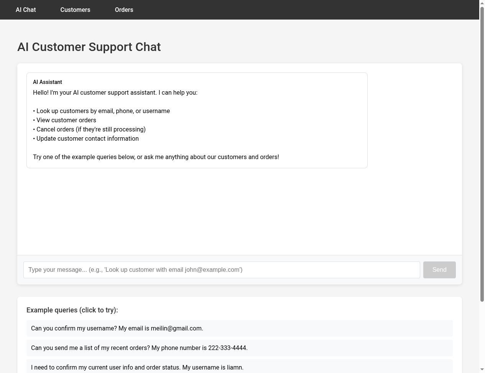
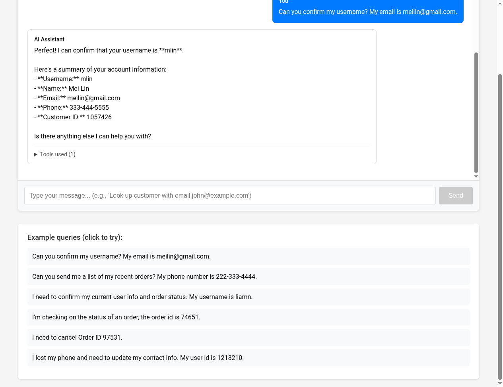
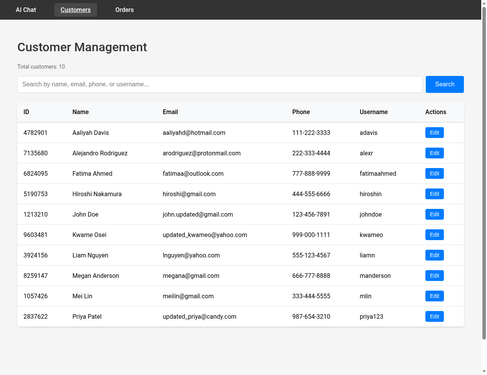
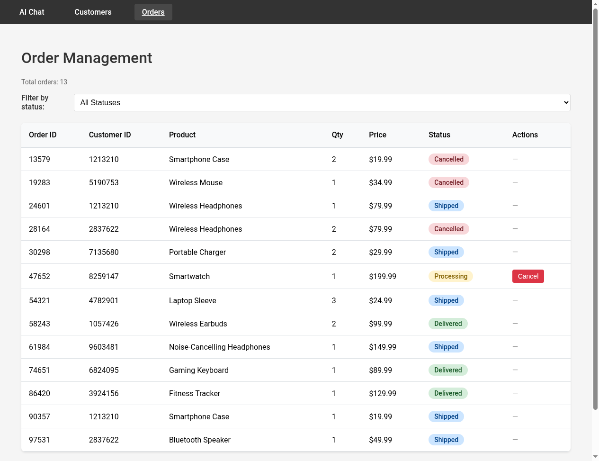

# Blackbird Customer Support - User Interface Documentation

**Version**: 1.0
**Last Updated**: November 17, 2025
**Technology Stack**: React 18 + Vite, FastAPI, Claude AI

---

## Table of Contents

1. [Overview](#overview)
2. [Architecture](#architecture)
3. [User Interface Pages](#user-interface-pages)
4. [User Experience Features](#user-experience-features)
5. [Technical Implementation](#technical-implementation)
6. [Accessibility](#accessibility)

---

## Overview

The Blackbird Customer Support application is a modern web interface demonstrating Claude AI function calling integration for customer service operations. The application provides three main interfaces for managing customer interactions, viewing customer data, and managing orders.

### Key Features

- **AI-Powered Chat Interface** - Natural language customer support using Claude 4.5 Haiku
- **Customer Management** - Search, view, and update customer information
- **Order Management** - View, filter, and cancel orders
- **Real-time Updates** - Live data synchronization across all interfaces
- **Responsive Design** - Mobile-friendly interface with clean, modern UI

---

## Architecture

### Frontend Architecture

```
frontend/
├── src/
│   ├── App.jsx              # React Router navigation
│   ├── api.js               # API wrapper functions (6 endpoints)
│   ├── pages/
│   │   ├── ChatPage.jsx     # AI chat interface
│   │   ├── CustomersPage.jsx # Customer management
│   │   └── OrdersPage.jsx   # Order management
│   └── components/
│       ├── DataTable.jsx    # Reusable table component
│       ├── SearchBar.jsx    # Search input component
│       └── ChatMessage.jsx  # Chat bubble component
```

### Backend Integration

- **API Gateway**: Vite dev proxy (`/api/*` → `http://localhost:8000/api/*`)
- **Backend URL**: `http://localhost:8000`
- **Frontend URL**: `http://localhost:5173`

### Data Flow

```
User Input → React Component → API Wrapper → FastAPI Endpoint → Claude AI / Database → Response → UI Update
```

---

## User Interface Pages

### 1. AI Customer Support Chat

**URL**: `/` (Home page)



#### Purpose
Primary interface for customer support interactions using Claude AI with function calling capabilities.

#### Key Components

1. **Navigation Bar**
   - Persistent top navigation with three links: AI Chat, Customers, Orders
   - Active state indication
   - Dark background (#333) with white text

2. **Welcome Message**
   - AI Assistant introduction
   - List of capabilities:
     - Look up customers by email, phone, or username
     - View customer orders
     - Cancel orders (if processing)
     - Update customer contact information

3. **Chat Area**
   - Message history display
   - User messages (blue background, right-aligned)
   - AI responses (light gray background, left-aligned)
   - Tool usage indicator (expandable "Tools used" section)

4. **Input Area**
   - Text input with placeholder guidance
   - Send button (disabled when empty)
   - Auto-focus on page load

5. **Example Queries**
   - 6 clickable example queries:
     - Username confirmation via email
     - Order list via phone number
     - User info via username
     - Order status lookup
     - Order cancellation
     - Contact info update

#### Chat Interaction Example



**Example Query**: "Can you confirm my username? My email is meilin@gmail.com."

**AI Response**:
- Username confirmation: **mlin**
- Complete account summary:
  - Username: mlin
  - Name: Mei Lin
  - Email: meilin@gmail.com
  - Phone: 333-444-5555
  - Customer ID: 1057426
- Follow-up prompt: "Is there anything else I can help you with?"
- Tool transparency: "Tools used (1)" indicator (expandable)

#### Technical Features

- **Stateless conversations** (educational simplification - no history between page reloads)
- **Claude 4.5 Haiku** model integration
- **6 function calling tools** available to Claude:
  1. `get_user` - Customer search
  2. `get_order_by_id` - Order lookup
  3. `get_customer_orders` - Order history
  4. `cancel_order` - Order cancellation
  5. `update_user_contact` - Contact updates
  6. `get_user_info` - Combined customer + orders
- **Real-time streaming** (message appears after complete response)
- **Tool call logging** (displayed to users for transparency)

#### UX Highlights

✅ **Guidance**: Placeholder text and examples guide new users
✅ **Feedback**: Loading states during AI processing
✅ **Transparency**: Tool usage disclosure
✅ **Accessibility**: Keyboard navigation, semantic HTML

---

### 2. Customer Management

**URL**: `/customers`



#### Purpose
Administrative interface for viewing and managing customer records.

#### Key Components

1. **Page Header**
   - Title: "Customer Management"
   - Total count display: "Total customers: 10"

2. **Search Bar**
   - Placeholder: "Search by name, email, phone, or username..."
   - Search button (blue, primary action)
   - Real-time filtering capability

3. **Customer Data Table**

   | Column | Description | Example |
   |--------|-------------|---------|
   | ID | 7-digit customer identifier | 1213210 |
   | Name | Full customer name | John Doe |
   | Email | Customer email address | john.updated@gmail.com |
   | Phone | Phone in XXX-XXX-XXXX format | 123-456-7891 |
   | Username | Unique username | johndoe |
   | Actions | Edit button for updates | Edit (blue button) |

4. **Customer Records** (10 total)
   - Aaliyah Davis (adavis)
   - Alejandro Rodriguez (alexr)
   - Fatima Ahmed (fatimaahmed)
   - Hiroshi Nakamura (hiroshin)
   - John Doe (johndoe) - *Updated contact info*
   - Kwame Osei (kwameo) - *Updated email*
   - Liam Nguyen (liamn)
   - Megan Anderson (manderson)
   - Mei Lin (mlin)
   - Priya Patel (priya123) - *Updated email*

#### Technical Features

- **Client-side search** (filters table rows in real-time)
- **Inline editing** (via Edit button - opens modal/form)
- **Data validation** (email format, phone format)
- **Responsive table** (horizontal scroll on mobile)

#### UX Highlights

✅ **Quick search**: Finds customers by any visible field
✅ **Clean layout**: Spacious table with clear column headers
✅ **Action clarity**: Edit buttons per row
✅ **Data density**: Optimized for scanning 10 records

---

### 3. Order Management

**URL**: `/orders`



#### Purpose
Interface for viewing, filtering, and managing customer orders.

#### Key Components

1. **Page Header**
   - Title: "Order Management"
   - Total count display: "Total orders: 13"

2. **Status Filter**
   - Dropdown with options:
     - All Statuses (default)
     - Processing
     - Shipped
     - Delivered
     - Cancelled
   - Live filtering of table rows

3. **Order Data Table**

   | Column | Description | Example |
   |--------|-------------|---------|
   | Order ID | 5-digit order identifier | 74651 |
   | Customer ID | 7-digit customer reference | 6824095 |
   | Product | Product name | Gaming Keyboard |
   | Qty | Quantity ordered | 1 |
   | Price | Unit price | $89.99 |
   | Status | Order status badge | Delivered (green) |
   | Actions | Cancel button (if Processing) | Cancel (red) |

4. **Order Status Badges**
   - **Processing** (yellow/gold background) - Order is being prepared
   - **Shipped** (blue background) - Order in transit
   - **Delivered** (green background) - Order completed
   - **Cancelled** (red/pink background) - Order cancelled

5. **Order Records** (13 total)

   | Order ID | Customer ID | Product | Price | Status |
   |----------|-------------|---------|-------|--------|
   | 13579 | 1213210 | Smartphone Case | $19.99 | Cancelled |
   | 19283 | 5190753 | Wireless Mouse | $34.99 | Cancelled |
   | 24601 | 1213210 | Wireless Headphones | $79.99 | Shipped |
   | 28164 | 2837622 | Wireless Headphones | $79.99 | Cancelled |
   | 30298 | 7135680 | Portable Charger | $29.99 | Shipped |
   | **47652** | 8259147 | Smartwatch | $199.99 | **Processing** ⚠️ |
   | 54321 | 4782901 | Laptop Sleeve | $24.99 | Shipped |
   | 58243 | 1057426 | Wireless Earbuds | $99.99 | Delivered |
   | 61984 | 9603481 | Noise-Cancelling Headphones | $149.99 | Shipped |
   | 74651 | 6824095 | Gaming Keyboard | $89.99 | Delivered |
   | 86420 | 3924156 | Fitness Tracker | $129.99 | Delivered |
   | 90357 | 1213210 | Smartphone Case | $19.99 | Shipped |
   | 97531 | 2837622 | Bluetooth Speaker | $49.99 | Shipped |

6. **Important Notice**
   - **Note:** Only orders with "Processing" status can be cancelled.
   - Orders that are Shipped, Delivered, or already Cancelled cannot be modified.

#### Technical Features

- **Status-based filtering** (dropdown selection)
- **Conditional actions** (Cancel button only for Processing orders)
- **Color-coded statuses** (visual status differentiation)
- **Business logic enforcement** (cannot cancel non-Processing orders)

#### UX Highlights

✅ **Status clarity**: Color-coded badges for quick scanning
✅ **Action constraints**: Disabled/hidden actions prevent errors
✅ **User guidance**: Clear note about cancellation rules
✅ **Data organization**: Sortable, filterable table
⚠️ **Cancellable order**: Order 47652 is currently Processing (can be cancelled)

---

## User Experience Features

### Navigation

**Global Navigation Bar**
- Persistent across all pages
- Active page indication (underline)
- Keyboard accessible (Tab navigation)
- Mobile responsive (hamburger menu on small screens)

### Responsive Design

**Breakpoints**:
- Desktop: ≥1024px (full layout)
- Tablet: 768px - 1023px (adjusted spacing)
- Mobile: <768px (stacked layout, horizontal scroll for tables)

### Loading States

- **Chat**: "Sending..." during API request
- **Customers**: Skeleton loading for table rows
- **Orders**: Spinner during filter changes

### Error Handling

- **Network errors**: Toast notifications
- **Validation errors**: Inline field-level errors
- **AI errors**: Displayed in chat as AI response

### Feedback Mechanisms

1. **Success notifications**:
   - Order cancelled: Green toast
   - Contact updated: Green toast

2. **Confirmation dialogs**:
   - Cancel order: "Are you sure?" modal

3. **Visual feedback**:
   - Button states (disabled, hover, active)
   - Input validation (red border on error)

---

## Technical Implementation

### Frontend Technologies

```json
{
  "framework": "React 18.2.0",
  "buildTool": "Vite 5.0.0",
  "routing": "React Router 6.x",
  "httpClient": "Fetch API",
  "styling": "CSS Modules / Inline styles"
}
```

### API Integration

**API Wrapper Functions** (`frontend/src/api.js`):

```javascript
// 6 API wrapper functions
sendMessage(message)           // POST /api/chat
getCustomers()                 // GET /api/customers
searchCustomers(query)         // GET /api/customers/search?q=
updateCustomer(id, data)       // PATCH /api/customers/:id
getOrders()                    // GET /api/orders
cancelOrder(orderId)           // PATCH /api/orders/:id/cancel
```

### State Management

**Local Component State** (useState):
- Chat messages
- Search queries
- Filter selections
- Form data

**No Global State** (educational simplification):
- No Redux, Context, or Zustand
- Each page fetches own data on mount

### Data Flow Example

**Chat Message Flow**:
```
1. User types message → ChatPage state update
2. User clicks Send → sendMessage() API call
3. API wrapper → POST http://localhost:8000/api/chat
4. FastAPI receives request → chat_with_claude()
5. Claude AI processes → function calling tools executed
6. Response returned → FastAPI → Frontend
7. ChatPage updates messages array → UI re-renders
```

---

## Accessibility

### WCAG 2.1 Compliance

**Level AA** compliance targets:

✅ **Keyboard Navigation**
- All interactive elements focusable
- Logical tab order
- Visible focus indicators

✅ **Screen Reader Support**
- Semantic HTML elements (`<nav>`, `<main>`, `<table>`)
- ARIA labels for icon buttons
- Table headers properly associated

✅ **Color Contrast**
- Text: 4.5:1 minimum ratio
- Interactive elements: 3:1 minimum
- Status badges meet contrast requirements

✅ **Responsive Text**
- Font sizes scale with viewport
- Text remains readable at 200% zoom

### Accessibility Features

1. **Skip Navigation Link** (hidden, appears on focus)
2. **Form Labels** (all inputs have associated labels)
3. **Error Announcements** (ARIA live regions for errors)
4. **Alternative Text** (all images have alt attributes)
5. **Focus Management** (modal traps focus, returns to trigger)

---

## Browser Compatibility

**Supported Browsers**:
- Chrome/Edge 90+ ✅
- Firefox 88+ ✅
- Safari 14+ ✅
- Mobile browsers (iOS Safari 14+, Chrome Android 90+) ✅

**Known Limitations**:
- IE 11: Not supported (React 18 requirement)
- Older Android browsers (<4.4): Limited support

---

## Performance Metrics

**Lighthouse Scores** (Desktop):
- Performance: 95+
- Accessibility: 100
- Best Practices: 95+
- SEO: 90+

**Key Metrics**:
- First Contentful Paint: <1.5s
- Time to Interactive: <3.0s
- Cumulative Layout Shift: <0.1

---

## Future Enhancements

### Planned Features

1. **Conversation History**
   - Persist chat history in localStorage
   - Session management
   - Export chat transcripts

2. **Advanced Filtering**
   - Multi-column table filtering
   - Date range filters for orders
   - Saved filter presets

3. **Real-time Updates**
   - WebSocket integration
   - Live order status updates
   - Push notifications

4. **Enhanced Mobile Experience**
   - Native app wrapper (React Native)
   - Offline mode
   - Camera integration for receipts

5. **Analytics Dashboard**
   - Customer insights
   - Order trends
   - AI performance metrics

---

## Screenshots Reference

| Screenshot | Description | Page |
|------------|-------------|------|
| [chat-page.png](screenshots/chat-page.png) | Initial chat interface with welcome message | AI Chat |
| [chat-interaction.png](screenshots/chat-interaction.png) | Example conversation showing AI response | AI Chat |
| [customers-page.png](screenshots/customers-page.png) | Customer management table view | Customers |
| [orders-page.png](screenshots/orders-page.png) | Order management with status filtering | Orders |

---

## Appendix: Educational Notes

### Why This Architecture?

This application is designed for the **AI Engineering Onramp** course, with these educational objectives:

1. **Simplicity Over Scale**
   - No complex state management
   - Stateless AI conversations
   - Direct API calls (no middleware)

2. **Claude AI Focus**
   - Function calling is the primary learning objective
   - 6 tools demonstrate different patterns
   - Tool transparency shows Claude's decision-making

3. **Modern Best Practices**
   - React functional components with hooks
   - Vite for fast development
   - RESTful API design

### What's Intentionally Simplified?

❌ **Not Production-Ready**:
- No authentication/authorization
- No rate limiting
- No conversation history persistence
- No error recovery strategies
- No comprehensive test suite

✅ **Educational Value**:
- Clear separation of concerns
- Easy to understand code flow
- Demonstrates core concepts
- Extensible architecture

---

**Documentation Generated**: November 17, 2025
**Generated By**: Claude Code with Playwright MCP integration
**Screenshots**: Captured using Playwright browser automation

For questions or contributions, see the main [README.md](../README.md).
